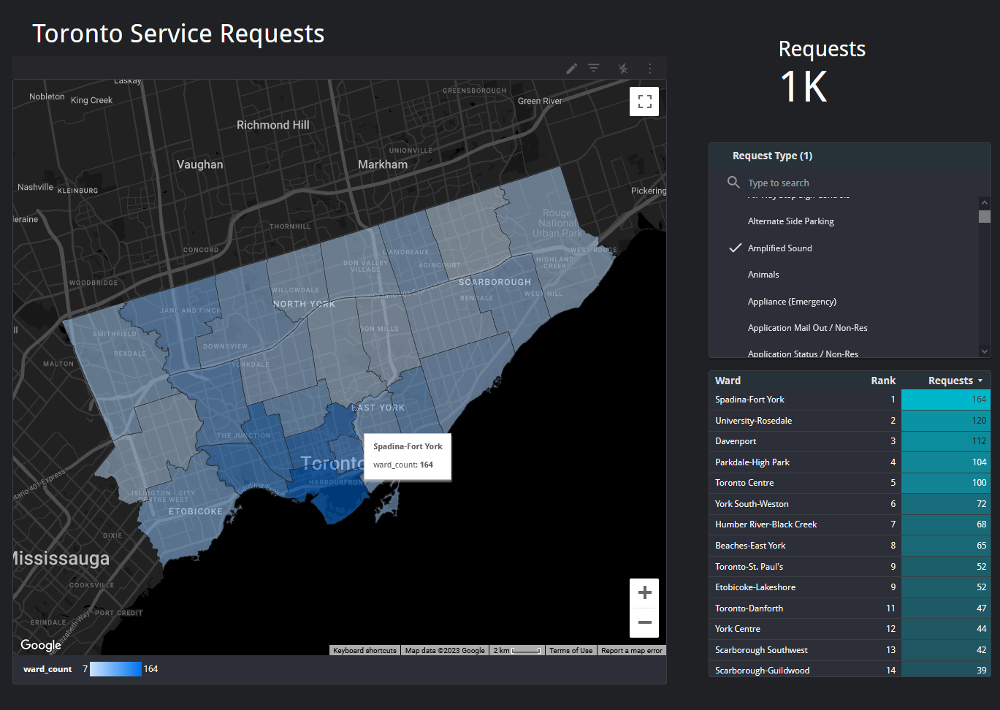
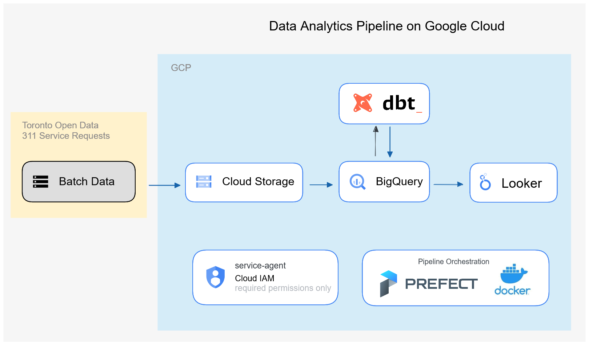

# Data engineering zoomcamp - 311 Service Calls

This is a visualization of the service calls initiated by Toronto citizens. The choropleth map is broken down into the resident's ward, as well as the types of requests being made. The result is a heatmap of the types of service requests fulfilled for each neighborhood in Toronto.

## Motivation

Besides finding the area with the most noise complaints, this project is an exercise in implementing a data pipeline that incorporates reliability, traceability, and resiliency. Concretely speaking, a pipeline following those principles should have these characteristics:

- restartable - can each step be replayed without introducing duplicates or creating errors?
- monitoring and logging - each step should provide some heartbeat pulse if successful, or error logs if otherwise
- simple - no extra code
- able to handle schema drift *or* enforce a data contract
- efficiency - relating to reliability, how do we model our data to minimize compute? E.g. partitioning and/or clustering, or creating a compact view for end-user to query against, instead of querying against the whole dataset
- able to handle late data
- good data quality - processing to remove void entries, e.g. entries missing ward or FSA code

## Data visualization

[Link to Looker dashboard](https://lookerstudio.google.com/reporting/fb6bd9a4-9efc-4999-bd81-d850dd25e51d)



## Project architecture



- Data is pulled on a monthly basis to sync with its refresh rate at the source
- data lake: GCS
  - stores raw csv and schema'd parquets
  - remove outliers in dates
  - remove entries without ward/FSA data
  - feature engineer
    - add `seasons`
- data warehouse: Bigquery
  - part of extraction to create a facts table with the schema'd parquets from gcs
  - stores the various models used for visualizations
  - partitioning/clustering
- transform: dbt
  - models the raw datasets that have been loaded onto bigquery
  - documentation
  - tests for schema drift
- orchestration: Prefect
  - facilitates monthly refresh: pull, process, store models
  - monitoring and logging
  - restarts
  - handles late data
  - executes via dockerized apps
- Visualization: Looker
  - combine with geojson to produce choropleth map
- Security: Cloud IAM
  - [service account with necessary permissions to manage cloud resources](https://registry.terraform.io/modules/terraform-google-modules/service-accounts/google/latest)
- IaC: Terraform
  - responsible for cloud infra
  - gcs bucket
  - bigquery dataset

## Run it yourself!

Clone this repo to start: `git clone https://github.com/vykuang/toronto-service-calls-2023.git`

### 0 Setup

Local requirements:

- gcloud - local credential should have enough permissions to create all necessary cloud resources on GCP, e.g. owner
- gsutil
- terraform
- prefect

### 1 GCP

Create project via console

Note the `PROJECT_ID`; will need to assign in `user.env`

To use any resource, the new project must be linked to a billing account. In console nav menu, go to Billing > Link to billing account. Default should be called `My Billing Account` if on free trial

### 2 Set Environment variables

Once a variable is defined, terraform can accept environment variables by searching for `TF_VAR_<VAR_NAME>`. E.g. if we have `var.project_id`, we can export `TF_VARS_project_id=my-first-project` and `terraform plan` will populate the variable correctly.

With a key/value pair list in `user.env`, export all of them in a script:

```bash
# default user.env file

TF_VAR_project_id= # fill here after creating project #
TF_VAR_region=us-west1  # change any of these to your liking
TF_VAR_zone=us-west1-b
TF_VAR_data_lake_bucket=service-data-lake
TF_VAR_bq_dataset=service_calls_models
TFSTATE_BUCKET=tf-state-service
```

Run this blurb to export `user.env` to environment

```bash
set -o allexport
source user.env
set +o allexport
```

### 3 Terraform

- Create bucket for terraform backend and initialize
- Creates resources for the project

```bash
# cd to terraform dir
cd terraform/
# make bucket for remote backend
gsutil mb \
-l $TF_VAR_region \
-p $TF_VAR_project_id \
-b on \
--pap enforced \
gs://$TFSTATE_BUCKET
# turn on versioning
gsutil versioning set on gs://$TF_VAR_data_lake_bucket
# may have to add -migrate-state option if there is existing tfstate
terraform init \
-backend-config="bucket=$TFSTATE_BUCKET" \
-backend-config="prefix=terraform/state"
# -migrate-state
terraform apply
```

`terraform apply` will create:

- GCS bucket
- bq dataset
- GCE instance, `server`, to orchestrate prefect flow
- GCE instance, `agent`, to execute prefect flow
- service account with permissions to access the above resources

View prefect server UI after creation completes at http://{server-external-IP}:4200

### 4 dbt

1. Clone the dbt models repository - `git clone https://github.com/vykuang/dbt-service-calls.git`
1. Create cloud dbt account
1. Connect to the bigquery dataset created from terraform
   - will need to download the service account json key from cloud console for upload
1. Connect to the dbt models repository
1. Replace the `project_id` vars in `dbt_project.yml` and the `sources: database` value in `models/staging/schema.yml`
1. run `dbt dept` and `dbt seed`
1. Create job with command `dbt build --var="is_test_run:false"`
1. Schedule the job on a monthly basis, to align with the frequency of the dataset update

### 5 Prefect

Deploy the flow; scheduled to run on 1st of every month

```sh
cd service_calls_311 && ./deploy.sh
```

### \[optional\] docker

The infrastructure to run the extract and load flows is dockerized; the `make_infra.py` block automatically pulls from a public docker hub that's been built from the local `Dockerfile`. However if you want to build your own:

1. from repo root: `docker build -t docker_hub_image_name:tag .`
1. push to public container repo: `docker push docker_hub_image_name:tag`
   - you may need to configure docker login first
1. change `image=docker_hub_image_name:tag` in `make_infra.py`, inside `infra_block`.

## data resources

Full credits to statscan and open data toronto for providing these datasets.

- [311 service requests](https://open.toronto.ca/dataset/311-service-requests-customer-initiated/)
- [city ward geojson](https://open.toronto.ca/dataset/city-wards/)
- [forward sortation area boundary file](https://www12.statcan.gc.ca/census-recensement/2011/geo/bound-limit/bound-limit-2016-eng.cfm)
  - FSA is the first three characters in the postal code and correspond roughly to a neighborhood
- [Article on converting that to geojson](https://medium.com/dataexplorations/generating-geojson-file-for-toronto-fsas-9b478a059f04)

## Peer Review Criteria

- Cloud - GCP and terraform
- data ingestion - extract and load subflows; intermediate storage in GCS
- data warehouse - bigquery, partition by datetime, cluster by ward and service type
- transformations - dbt
- dashboard - looker with choropleth and ward ranking by request type
